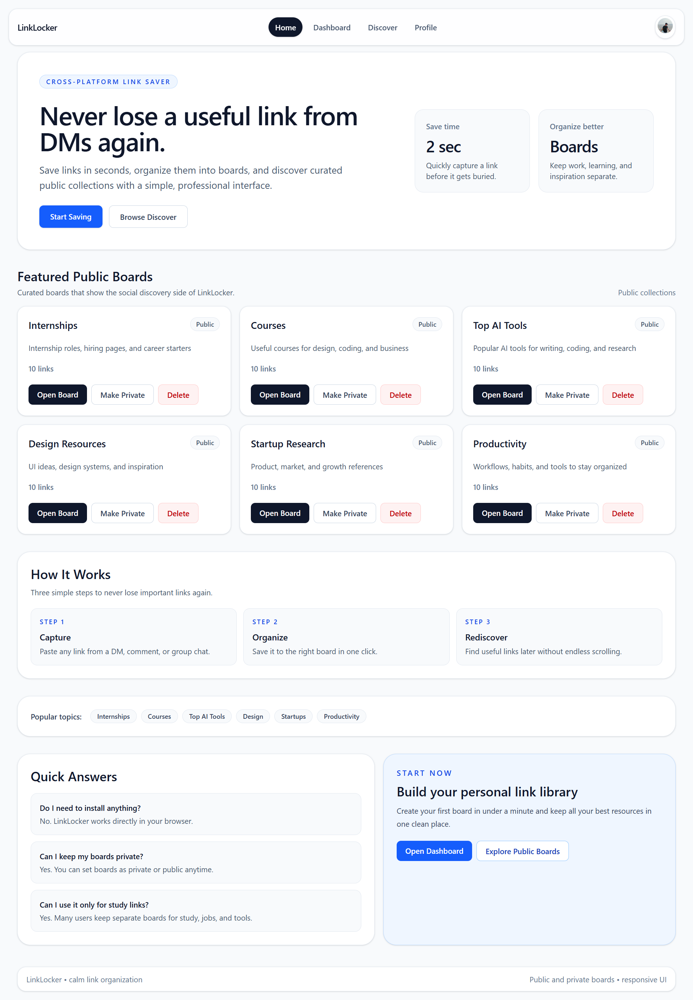
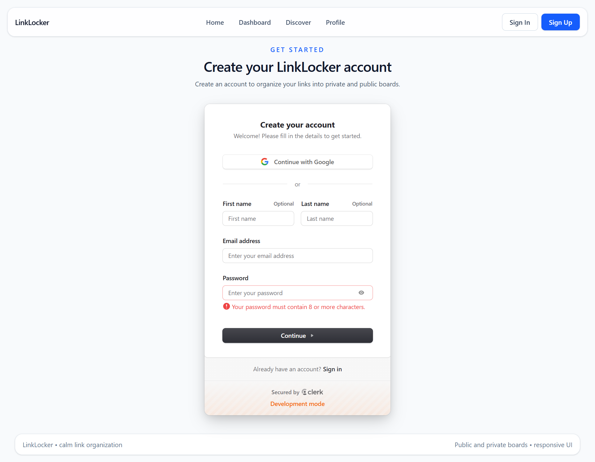
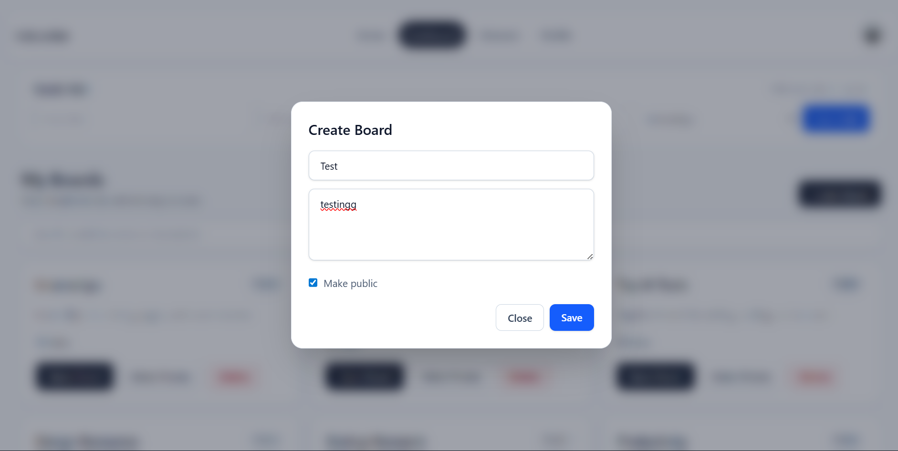

# LinkLocker

LinkLocker is a web app to save links from DMs, chats, and social media comments.
You can organize links into boards, keep boards private or public, and discover public boards.

This README explains everything in simple language so anyone can run this project on their own machine.

## Screenshots

<p align="center">
	
	
</p>
<p align="center">
	
	
</p>

## 1. What This Project Uses


- Frontend: React + Vite + Tailwind
- Auth: Clerk
- Database: Supabase (PostgreSQL + RLS)
- Backend helper: Node.js + Express (metadata endpoint)

## 2. Before You Start

Install these tools first:

1. Node.js 20+ (recommended LTS)
2. npm (comes with Node)
3. Git
4. A code editor (VS Code recommended)

Check versions:

```bash
node -v
npm -v
git --version
```

## 3. Clone And Install

```bash
git clone https://github.com/shiv-0101/LinkLocker-Links-Managegment-App.git
cd LinkLocker-Links-Managegment-App
npm install
```

Important: run commands from the project folder where `package.json` exists.

## 4. Create Your Own Supabase Project (Database)

1. Go to https://supabase.com and create account/login.
2. Create a new project.
3. Open `SQL Editor` in Supabase.
4. Run this SQL to create required tables and policies:

```sql
create extension if not exists "pgcrypto";

create table if not exists boards (
	id uuid primary key default gen_random_uuid(),
	user_id text not null,
	name text not null,
	description text default '',
	is_public boolean not null default false,
	created_at timestamptz not null default now()
);

create table if not exists links (
	id uuid primary key default gen_random_uuid(),
	board_id uuid not null references boards(id) on delete cascade,
	user_id text not null,
	title text not null,
	url text not null,
	metadata jsonb,
	created_at timestamptz not null default now()
);

create index if not exists idx_boards_user_id on boards(user_id);
create index if not exists idx_boards_is_public on boards(is_public);
create index if not exists idx_links_board_id on links(board_id);
create index if not exists idx_links_user_id on links(user_id);
create index if not exists idx_links_created_at on links(created_at desc);

alter table boards enable row level security;
alter table links enable row level security;

drop policy if exists "boards_public_read" on boards;
create policy "boards_public_read" on boards
for select using (is_public = true);

drop policy if exists "boards_owner_all" on boards;
create policy "boards_owner_all" on boards
for all
using (user_id = auth.jwt() ->> 'sub')
with check (user_id = auth.jwt() ->> 'sub');

drop policy if exists "links_public_read" on links;
create policy "links_public_read" on links
for select
using (
	exists (
		select 1 from boards b
		where b.id = links.board_id
			and b.is_public = true
	)
);

drop policy if exists "links_owner_all" on links;
create policy "links_owner_all" on links
for all
using (user_id = auth.jwt() ->> 'sub')
with check (user_id = auth.jwt() ->> 'sub');
```

## 5. Create Your Own Clerk Project (Authentication)

1. Go to https://clerk.com and create account/login.
2. Create a new application.
3. Enable Email sign up/sign in.
4. Copy keys from Clerk dashboard:
	 - Publishable key (starts with `pk_...`)
	 - Secret key (starts with `sk_...`) if needed later for backend work

### Required: Create Clerk JWT template for Supabase

If you skip this, board creation will fail with RLS error.

1. In Clerk dashboard, open `JWT Templates`.
2. Create template with name: `supabase`.
3. Set claims so Supabase can trust it:
	 - `sub`: default Clerk user id
	 - `role`: `authenticated`
	 - `aud`: `authenticated`
4. Save template.

After creating it, sign out and sign in again in your app.

## 6. Get API/Environment Values (Your Own Keys)

### From Supabase

Go to `Project Settings` -> `API`:

- `VITE_SUPABASE_URL`: your project URL
- `VITE_SUPABASE_ANON_KEY`: anon public key
- `SUPABASE_SERVICE_ROLE_KEY`: service role key (keep private)

### From Clerk

Go to Clerk dashboard keys page:

- `VITE_CLERK_PUBLISHABLE_KEY`: publishable key

### App URL

- `VITE_API_URL=http://localhost:5000` for local backend

## 7. Create `.env.local`

Create a file named `.env.local` in project root and add:

```env
VITE_API_URL=http://localhost:5000
VITE_CLERK_PUBLISHABLE_KEY=pk_test_xxx

VITE_SUPABASE_URL=https://your-project-ref.supabase.co
VITE_SUPABASE_ANON_KEY=your_anon_key

SUPABASE_URL=https://your-project-ref.supabase.co
SUPABASE_SERVICE_ROLE_KEY=your_service_role_key
```

Do not commit real keys to public repos.

## 8. Run The Project (Step By Step)

Open 2 terminals from project root.

Terminal 1: backend

```bash
npm run dev:server
```

Expected:

```text
LinkLocker server running on http://localhost:5000
```

Terminal 2: frontend

```bash
npm run dev
```

Open URL shown by Vite (usually `http://localhost:5173` or similar).

## 9. Build Check (Recommended)

```bash
npm run build
```

If build passes, app is in good shape for local use.

## 10. Verify End-To-End Flow

Use this checklist:

1. Sign up with email
2. Verify email code page should stay open (no auto vanish)
3. Open Dashboard
4. Create board
5. Save link with Quick Add
6. Refresh page and confirm board/link still there
7. Open Discover and copy a link to your board

If all these work, your setup is correct.

## 11. Common Issues And Fixes

### A) `No JWT template exists with name: supabase`

Cause: Clerk template missing.

Fix:

1. Create JWT template `supabase` in Clerk
2. Add required claims (`sub`, `role`, `aud`)
3. Sign out and sign in again

### B) `new row violates row-level security policy for table "boards"`

Cause: Supabase did not receive valid authenticated JWT claim.

Fix:

1. Confirm Clerk template `supabase` exists
2. Confirm RLS policy uses `auth.jwt() ->> 'sub'`
3. Confirm board insert includes `user_id = current Clerk user id`
4. Sign out/in and retry

### C) Frontend command fails from wrong folder

Cause: running `npm run dev` from parent directory.

Fix: first run `cd LinkLocker-Links-Managegment-App`, then run command.

### D) Verification code page disappears quickly

Cause: auth route not matching Clerk nested paths.

Fix: app already uses wildcard routes `/sign-in/*` and `/sign-up/*`.

## 12. Scripts

- `npm run dev` -> run frontend
- `npm run dev:server` -> run backend
- `npm run build` -> production build
- `npm run preview` -> preview built frontend
- `npm run lint` -> lint checks

## 13. Security Notes

1. Never share `SUPABASE_SERVICE_ROLE_KEY` publicly.
2. Keep `.env.local` private.
3. If keys were exposed, rotate them immediately in Clerk/Supabase dashboard.

## 14. Suggested Next Improvements

1. Add edit/delete link flow directly from dashboard.
2. Add server-side verification for protected backend routes.
3. Add automated tests for auth + board CRUD + link CRUD.
4. Add deployment steps for Vercel/Render.

---

If you are a new developer joining this project, follow sections 2 -> 10 in order.
That is enough to run everything locally with your own API keys.
